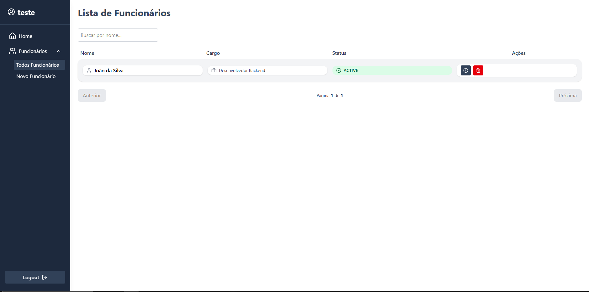

# 👥 Aplicação Web - Gerenciamento de Funcionários

## 📑 Índice

<div align="center">

| 🌟 Essenciais                          | 🛠️ Desenvolvimento             |
| -------------------------------------- | ------------------------------ | 
| [📋 Sobre](#sobre)                     | [💻 Tecnologias](#tecnologias) | 
| [⚙️ Funcionalidades](#funcionalidades) | [📦 Requisitos](#requisitos)   | 
| [🎯 Objetivos](#objetivos)             | [🔧 Instalação](#instalação)   | 

</div>

## 📋 Sobre

O sistema **Gerenciamento de Funcionários** é uma aplicação web que permite o cadastro e a administração de empresas, funcionários e cargos. Cada usuário pode registrar sua empresa e gerenciar seus próprios funcionários, garantindo isolamento e segurança entre contas.

---

## Objetivos

- Permitir que cada usuário crie e administre sua própria empresa
- Gerenciar funcionários associados a uma empresa
- Controlar cargos e status dos funcionários
- Garantir segurança de autenticação via JWT
- Fornecer uma interface web moderna e responsiva

---


### Diferenciais

- Interface moderna e responsiva com TailwindCSS
- Autenticação segura com OAuth2 e JWT
- API RESTful 
- Sistema de notificações com Toastr

## 💻 Tecnologias

### Backend

- Java 21
- Spring Boot 3.5.3
- Spring Security + JWT
- Spring Data JPA
- PostgreSQL
- Flyway
- Lombok
- MapStruct
- H2 (ambiente local/testes)
- Swagger (em breve)

### Frontend

- React 19
- TailwindCSS
- Axios
- React Router DOM
- React Hook Form
- React Toastify
- JWT Decode
- Lucide Icons
- Framer Motion

---

## ⚙️ Funcionalidades

### Usuário e Empresa

- Registro de usuário
- Login com autenticação JWT
- Cadastro de empresa associada ao usuário autenticado
- Cada usuário pode ter apenas **uma empresa**

### Funcionários

- Cadastro e listagem de funcionários da empresa do usuário
- Atualização e exclusão de funcionários
- Paginação e busca por nome
- Visualização de detalhes de cada funcionário

### Cargos

- Cadastro de cargos (positions)
- Associação de cargos aos funcionários

 

---

## 📦 Requisitos

- Java 17+
- Node.js 18+
- PostgreSQL 12+
- Maven 3.6+

---

## Instalação

### Backend

1. Clone o repositório:

```bash
git clone https://github.com/seu-usuario/gerenciador-funcionarios.git
cd gerenciador-funcionarios
```

2. Configure o banco de dados PostgreSQL no arquivo `src/main/resources/application.yml`

3. Execute o backend:

```bash
mvn spring-boot:run
```

O servidor estará disponível em `http://localhost:8080`

### Frontend

1. Navegue até a pasta do frontend:

```bash
cd FrontEnd_Gerenciador_Funcionarios
```

2. Instale as dependências:

```bash
npm install
```

3. Execute o frontend:

```bash
npm start
```
4. Instale as dependencias e rode o projeto:
```bash
npm install
```

```bash
npm run dev
```

A aplicação estará disponível em `http://localhost:5173`

<div align="center">

Se este projeto te ajudou, considere dar uma estrela!

[ Voltar ao topo](#sobre)

</div>
